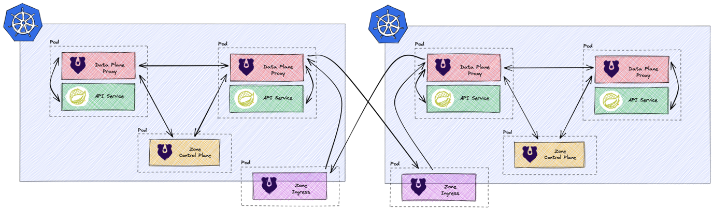

- [Kuma Service Mesh Installation](#kuma-service-mesh-installation)
  - [Preconditions](#preconditions)
  - [Deployment-Architecture](#deployment-architecture)
  - [Installation](#installation)
    - [Tags](#tags)
    - [Control-Planes](#control-planes)
      - [Kuma Global Control-Plane](#kuma-global-control-plane)
      - [Kuma Zone Control-Plane Kubernetes/OpenShift](#kuma-zone-control-plane-kubernetesopenshift)
    - [Data-Planes](#data-planes)
      - [Kuma Data-Planes Kubernetes](#kuma-data-planes-kubernetes)
  - [Kong Ingress Controller (KIC)](#kong-ingress-controller-kic)
  - [Configuration](#configuration)
      - [mTLS](#mtls)
      - [Metrics (Prometheus)](#metrics-prometheus)
      - [Tracing (Zipkin)](#tracing-zipkin)
      - [Logging (stdout)](#logging-stdout)
  - [Installing the Kuma Counter demo](#installing-the-kuma-counter-demo)

# Kuma Service Mesh Installation

This playbook installs the basic components to run the Kuma Service Mesh with minimal configuration.
In this case, the configuration concerns `mTLS`, `Tracing`, `Logging` and `Metrics`.

## Preconditions

* Ansible 2.11 installed
  * Kubernetes module (`ansible-galaxy collection install kubernetes.core`)
* kubectl installed
* kumactl installed
* helm installed (Version >= 3.8.0)

## Deployment-Architecture


* Global Control-Plane is deployed in Azure AKS cluster. This cluster is used for monitoring and other master services, like Kong Control Plane and so on
* Zone Control-Planes are deployed in Oracle cloud (OKE) and Azure (AKS). These control planes are deployed next to the workloads
* Kong Ingress Controller is placed as Mesh Gateway to able to access the services in the mesh from outside the mesh

## Installation

The following components can be deployed with this Ansible Playbook:

* Kuma Global Control-Plane
* Kuma Zone Control-Plane Kubernetes
* Kuma Data-Planes Kubernetes

The installation can be started with the following command:

```bash
ansible-playbook kuma.yaml -i inventories/<ENV>/hosts --tags="<TAGS>" --ask-vault-pass
```

### Tags

- **deploy** 
  - deploy_global
  - deploy_zone_cp
    - deploy_zone_cp_k8s
- **configure**
- **purge**
  - purge_global
  - purge_zone_cp
    - purge_zone_cp_k8s
  - purge_metrics

### Control-Planes

#### Kuma Global Control-Plane
* Deployment-Target:  OpenShift or Kubernetes cluster (AKS cluster in this demo)
* Ansible-Tag:      `ansible-playbook kuma.yaml -i inventories/azure/hosts --tags="deploy_global" --ask-vault-pass`

The global zone runs in a separate Kubernetes/OpenShift cluster that is responsible for managing the zone control planes.

#### Kuma Zone Control-Plane Kubernetes/OpenShift
* Deployment-Target: OpenShift or Kubernetes cluster (AKS and OKE cluster in this demo)
* Ansible-Tag:      `ansible-playbook kuma.yaml -i inventories/<ENV>/hosts --tags="deploy_zone_cp_k8s" --ask-vault-pass`



### Data-Planes

Adding data planes is done by the Ansible scripts automatically and is provided here only for purposes of understanding and possible Troubleshooting listed:

#### Kuma Data-Planes Kubernetes

A separate data plane must be deployed for each running service. This happens automatically in Kubernetes/OpenShift, if the
the following annotation was added to the service itself and to the namespace containing the service:

Within the Kubernetes zone, existing services must have the following annotation:

```yaml
annotations:
  ingress.kubernetes.io/service-upstream: true
```

In addition, all namespaces that are to be integrated into the mesh must be annotated as follows:

```yaml
Annotations:
  kuma.io/mesh: demo
  kuma.io/sidecar-injection: enabled
```

Finally, **SecurityContextConstraints** must be created for each namespace in **OpenShift** (not necessary in other K8s distributions). If you're working on a plain Kubernetes distribution, you can omit the following step.

```bash
oc adm policy add-scc-to-group nonroot system:serviceaccounts:<app-namespace>
```

## Kong Ingress Controller (KIC)

The installation of KIC is done by Helm. As KIC is from a mesh perspective just another service, we also need to prepare the target namespace as shown earlier. Installing the KIC in namespace 'kong' and adding it to the mesh can be done by running the following script:

```bash
  ./kong-ingress/install-ingress.sh
```

## Configuration

With the Ansible role `configure` the following components of Kuma are configured (the definition of Kuma mesh is changed):
- mTLS
- Metriken (mit Prometheus)
- Tracing (mit Zipkin)
- Logging (loki/fileout)

The configuration can be started with the following command:

```bash
`ansible-playbook kuma.yaml -i inventories/azure/hosts --tags="configure" --ask-vault-pass`
```

Service mesh features, like mTLS, Metrics, Tracing and Logging are configurable via `all.yaml` in the corresponding inventory:

#### mTLS
```ymal
mtls:
	enabled: true
	mode: STRICT
```

#### Metrics (Prometheus)
```ymal
metrics:
	enabled: true
	namespace: kuma-metrics
	prometheus_address: kuma-metrics.apps.example.com
```

#### Tracing (Zipkin)
```ymal
logging:
	enabled: true
```

#### Logging (stdout)
```ymal
tracing:
	enabled: true
	collector_address: tempo-zipkin.apps.example.com
```

## Installing the Kuma Counter demo

For the demo, we're using the [Kuma Counter Demo](https://github.com/kumahq/kuma-counter-demo). Based on the app, we demonstrate different aspects (see in the 'samples' folder). You can also use this demo app to play around with Kuma. The installation is done by simply apply the Kubernetes manifest from the GitHub Repo on your target Cluster:

```bash
kubectl apply -f https://raw.githubusercontent.com/kumahq/kuma-counter-demo/master/demo.yaml
```

The uninstallation of Kuma in the Kubernetes environment only includes deleting all resources such as CRDs, roles, etc. On the other hand, at the uninstallation on zone control planes as well as the zone data planes all relevant data such as the program directory `/opt/kuma` as well as services (e.g. `kuma-cp.service`. `kuma-dp.service`) removed.

Kuma can be completely removed with the following command, using the tags listed above:

```bash
ansible-playbook kuma.yaml -i inventories/<ENV>/hosts --tags="purge_<COMPONENT>"
```
